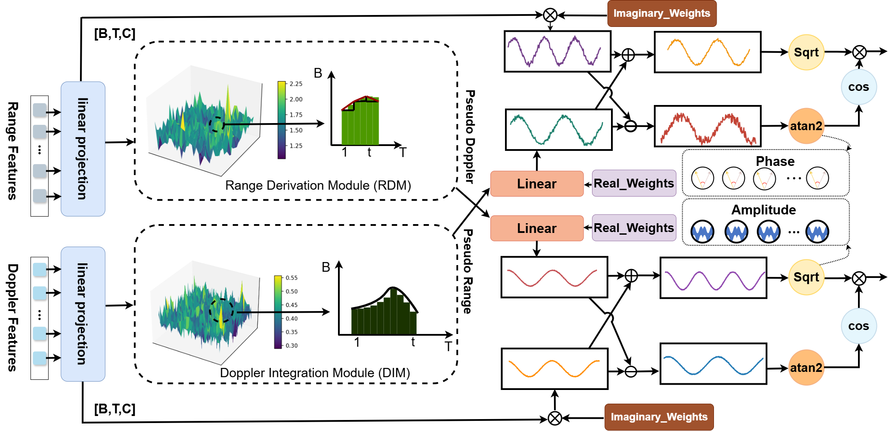
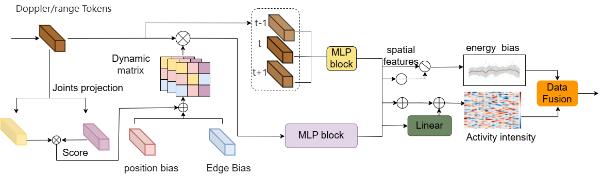
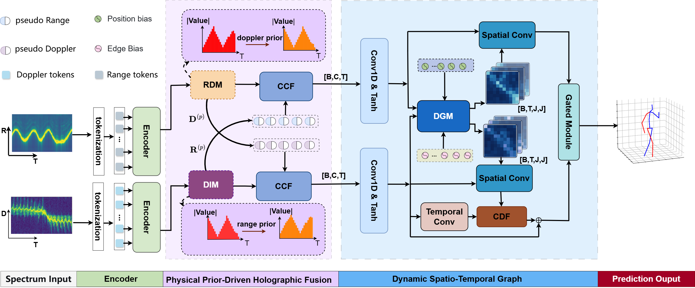
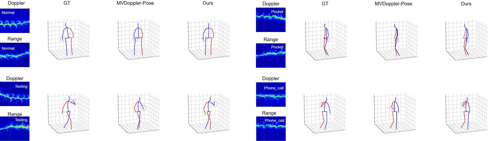

# PPDL: Physics-Prior Dynamic Learning for Human Pose Estimation from mmWave Radar


## Innovation Points
## PPDHF Module
<p align="center">
   
</p>

## DSTG Module
<p align="center">
   
</p>

## Introduction

## Introduction

Millimeter-wave (mmWave) radar offers a privacy-preserving and lighting-invariant alternative to RGB sensors for human pose estimation (HPE) tasks. To this end, the collaborative integration of multimodal millimeter-wave signals has emerged as an increasingly promising direction. However, specular reflection inevitably causes limb signal loss, while cross-modal physical constraints are often neglected. These issues severely challenge effective multimodal fusion and dynamic skeleton-graph relation learning. To address these limitations, we propose Physical Prior Dynamic Learning (PPDL), a framework for radar-based human pose estimation. To enable effective multimodal fusion, we propose a Physical Prior-Driven Holographic Fusion (PPDHF) module, which constructs cross-modal pseudo-representations through physics-guided transformations and performs consistency fusion in the complex plane, thereby substantially enhancing the coupling and complementary utilization of multimodal information. However, feature representations within individual modalities may still amplify background clutter and non-human noise. We further propose a Dynamic Spatio-Temporal Graph (DSTG) module, which reshapes spatial structures by integrating a learnable dynamic matrix, positional bias, and edge bias, thereby weakening spurious multipath effects and alleviating geometric misalignment. Meanwhile, a spatio-temporal coherence mechanism is employed to suppress asynchronous noise and improve the continuity of inter-frame geometric representations. Extensive experiments on the MVDoppler-Pose and HuPR datasets demonstrate that PPDL outperforms state-of-the-art methods on both 2D and 3D human pose estimation tasks.

## Framework




## Visualizations




## Environment:
- **Python**: 3.10.8
- **PyTorch**: 1.13.1
- **CUDA**: 11.6
- **CuDNN**: 8
- The runtime environment can be directly imported through this **[Docker image](https://hub.docker.com/r/gogoho88/stanford_mmwave)**.

## Dataset
- Dowload the dataset and annotations from the following link **[MVDoppler-Pose](https://drive.google.com/drive/folders/11e_L9glHIoE5O8o1kukAA-M_2me60Vmy)** and **[HUPR](https://huggingface.co/datasets/nirajpkini/HuPR)** .

## Training the Model
- Specify your dataset folder and annotations file path inside /conf/config_keypoint_adjust.yaml
- Run the training script:
```bash
python main_multi_keypoint.py
```

## Model Inference
- Download our pre-trained checkpoints [here](https://drive.google.com/drive/folders/1OsCCf15pCRin6-V9w71MioNoeJngWdiX). 
- In [/conf/config_inference.yaml](./conf/config_inference.yaml), specify the path to your downloaded checkpoints and configurations using path_model and path_args.
- Specify your preferred output save directory in path_save.
- Set the test sequence name in test_episode.
- Run the inference script:
```bash
python main_inference_keypoint.py
```

## Related Projects
Our code is inspired by and built upon **[MVDoppler-Pose](https://github.com/gogoho88/MVDoppler-Pose)** and **[HuPR](https://github.com/robert80203/HuPR-A-Benchmark-for-Human-Pose-Estimation-Using-Millimeter-Wave-Radar)**.


